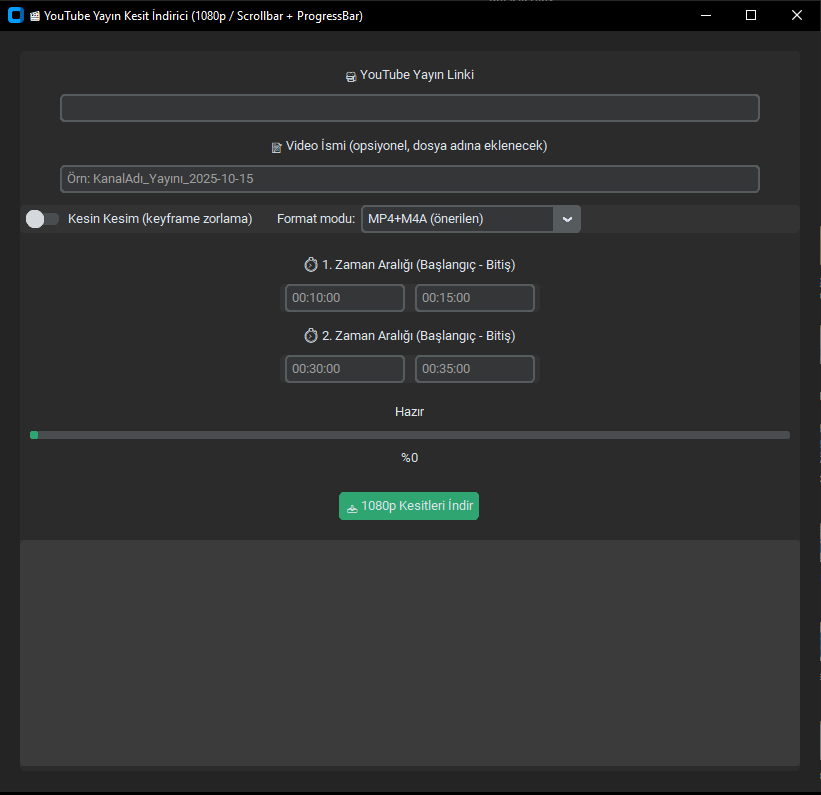

# 🎬 YouTube Yayın Kesit İndirici (1080p) — CustomTkinter GUI

[]()
[]()
[]()
[]()

YouTube canlı yayınları / uzun videolardan **seçili zaman aralıklarını 1080p MP4** olarak indirmenizi sağlayan, **CustomTkinter** tabanlı masaüstü uygulaması.  
🔊 Ses uçta kaybolmasın diye **format modu** ve **kesin kesim** gibi gelişmiş seçenekler içerir.

---

Program Ekran Görüntüsü

---
## ✨ Özellikler
- ⏱ **Zaman aralığına göre kesit indirme** (örn: `00:10:00 - 00:15:00`)
- 🧩 **Format modu** seçimi:
  - **MP4+M4A (önerilen)**
  - **Tek Akış MP4**
  - **Otomatik (eski)**
- 🎯 **Kesin kesim (keyframe zorlama)** opsiyonu
- 📈 **Canlı ilerleme çubuğu** ve **anlık log** (scrollbar’lı)
- 📝 **Video ismi** girip dosya adlarını özelleştirme
- 🧪 Son kısımda **ses kaybını minimize eden** ffmpeg ayarları
- 💻 Hafif, koyu tema, modern görünüm (CustomTkinter)

---

## ❓ Bu proje nedir? / Neden kullanılır?
Bu araç, yayınlardan veya uzun videolardan sadece istediğiniz **bölümü** hızlıca çekmek içindir.  
- ⏱️ Kurguya vakit harcamadan belirli dakikaları alın.  
- 📤 **YouTube Shorts / Reels / TikTok** gibi platformlara hızlı içerik üretin.  
- 🧰 “Ses uçta kesiliyor” gibi tipik problemler için **format ayarları** hazır.

Kimler kullanabilir?
- 🎥 İçerik üreticileri
- 📰 Haber / yayın kesitleri çıkaran editörler
- 🧑‍💻 Hızlı iş akışı isteyen herkes

---

## 🧩 Bağımlılıklar
- **Python 3.9+**
- **ffmpeg** (PATH’te olmalı)
- **yt-dlp**
- **customtkinter** (GUI)
- `tkinter` (Python ile birlikte gelir)

> Windows’ta `tkinter` genelde hazır gelir. Linux’ta gerekiyorsa: `sudo apt install python3-tk`

---

## 📦 Kurulum

### 1) Depoyu indir
```bash
git clone https://github.com/ebubekirbastama/youtube-kesit-indirici.git
cd youtube-kesit-indirici
```

### 2) Sanal ortam (opsiyonel ama önerilir)
```bash
python -m venv .venv
.venv\Scripts\activate   # Windows
source .venv/bin/activate  # macOS/Linux
```

### 3) Python paketleri
```bash
pip install -r requirements.txt
```

`requirements.txt` örneği:
```txt
yt-dlp>=2024.8.6
customtkinter>=5.2.2
```

### 4) ffmpeg kurulumu
- **Windows:** `choco install ffmpeg`
- **macOS:** `brew install ffmpeg`
- **Ubuntu/Debian:** `sudo apt install ffmpeg`

---

## ▶️ Çalıştırma
```bash
python app.py
```

---

## 🛠 Kullanım
1. 🎥 YouTube linkini girin.  
2. ⏱ Zaman aralıklarını `SS:DD:SS` formatında yazın.  
3. 📝 Video İsmi (opsiyonel).  
4. 🧩 Format modu seçin.  
5. 🔒 “Kesin Kesim” gerekiyorsa açın.  
6. 📥 **İndir**’e basın.

---

## 🧰 İpuçları
- Sesin uçta kaybolmasını önlemek için önce: **MP4+M4A (önerilen)** + **Kesin Kesim kapalı**.
- Sorun sürerse **Tek Akış MP4**’e geçin.

---

## 📜 Lisans
MIT Lisansı. Ayrıntılar için `LICENSE` dosyasına bakın.
